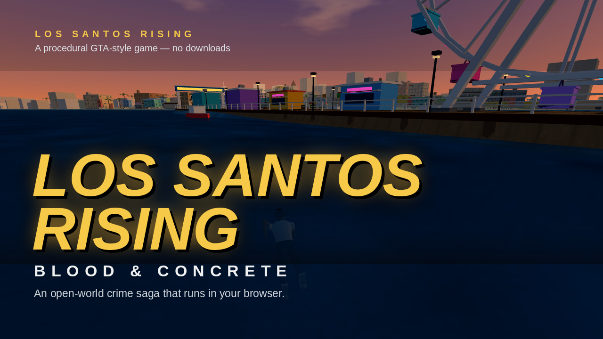
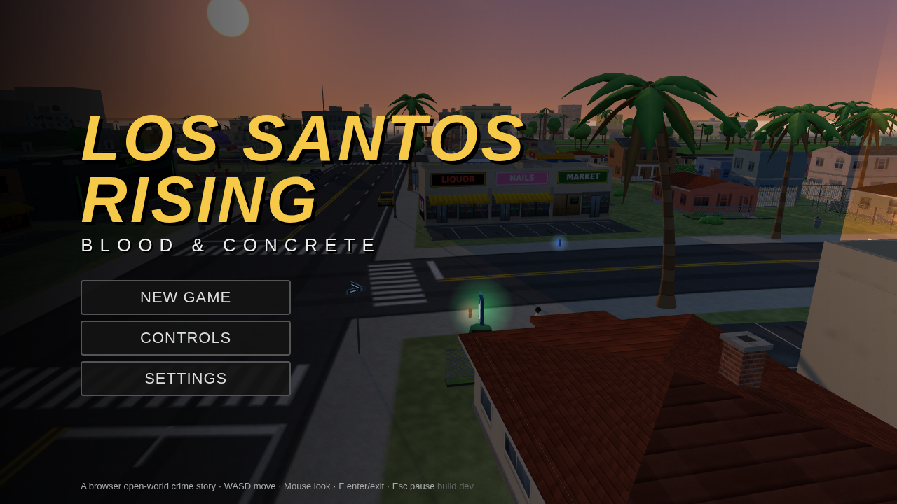
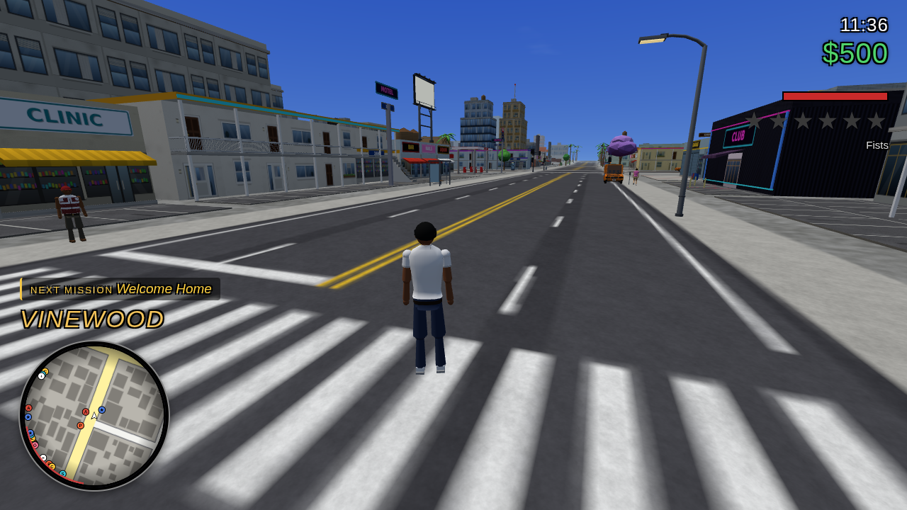
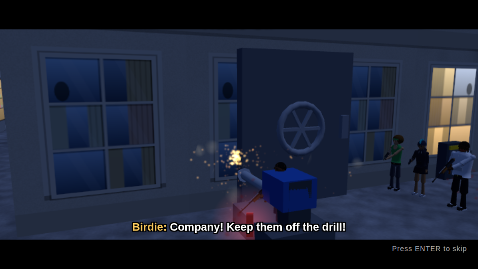
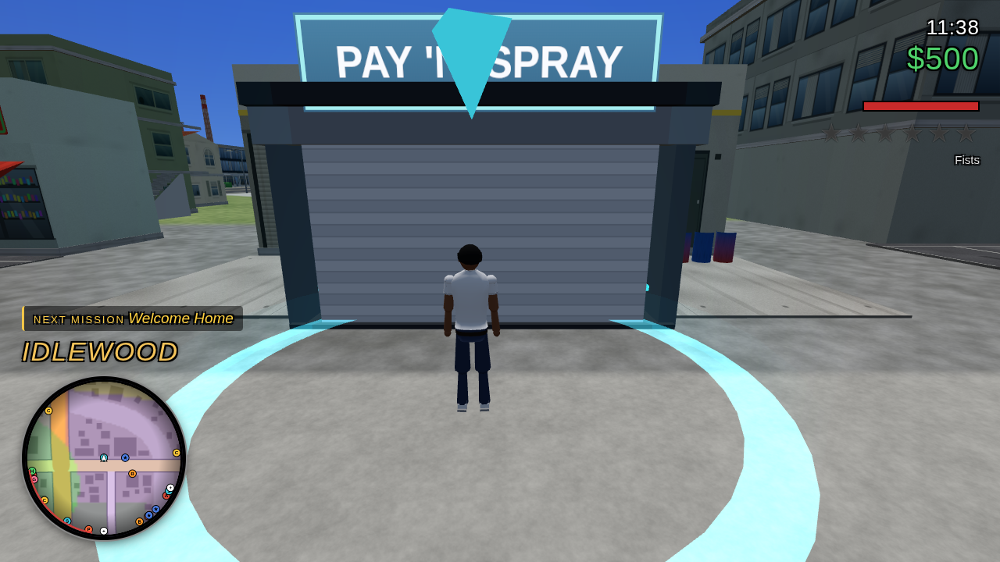

# LOS SANTOS RISING — Blood & Concrete



An open-world crime game that runs **in the browser**, inspired by *GTA: San Andreas*. Built with **three.js** and vanilla ES modules — **no build step, no downloads, no external assets**: every building, car, pedestrian, weapon, texture, sound and radio song is generated procedurally at runtime.

You are **Jay Mercer**, back in Los Santos because your sister has vanished. **24 story missions** across two chapters — turf wars, chases, a sniper hit, a harbour heist, an armoured-truck robbery, a bank job and a convoy finale — plus side quests, taxi/vigilante duty and a living, open city.

## Play

```bash
npm start            # = node server.js 8080
# open http://localhost:8080/
```

Any static server works — it's just `index.html` + `src/` + `assets/` + `lib/`. Chrome / Edge / Firefox with WebGL2; a mid-range GPU is enough (it lowers shadows and view distance on slow machines).

## Controls

| | |
|---|---|
| Move / look | `W A S D` / mouse |
| Sprint / jump / crouch | `Shift` / `Space` / `C` |
| Fire / aim | left mouse / right mouse |
| Weapon / reload | `Q` `E` wheel, `1`–`9` / `R` |
| Enter–exit–hijack vehicle | `F` |
| Interact (weapon dealer, save icon) | `E` |
| Drive | `W A S D`, `Space` handbrake, `H` horn, `C` look back |
| Radio | `R` / `T` tune, `X` off |
| Map / pause | `M` / `Esc` |
| Recruit homie / duty | `G` near Emerald Row / `N` in a taxi or police car |
| Cheats | type `cheatmode` while playing for the list |

## Screenshots

| | |
|---|---|
|  |  |
|  |  |

## Notes

- **Everything is procedural** — no asset files are downloaded, and there is no network access at runtime.
- The city is read from images in `assets/` (roads, districts, height, gang turf); `tools/make_map.py` authors the Los Santos-inspired layout.
- Save at the safehouse **save icon** (press `E`), and automatically after missions (`F5` quick-saves when free).
- Dev: `node tools/bot.js --from m01 --to m24` auto-plays the whole story with cheats to catch script errors.
- Architecture and conventions: [`docs/ARCHITECTURE.md`](docs/ARCHITECTURE.md) · [`docs/SPEC.md`](docs/SPEC.md).

## Credits

An AI-built fan-style homage. *Grand Theft Auto* and *San Andreas* belong to Rockstar Games; this contains none of their assets, characters or story.
